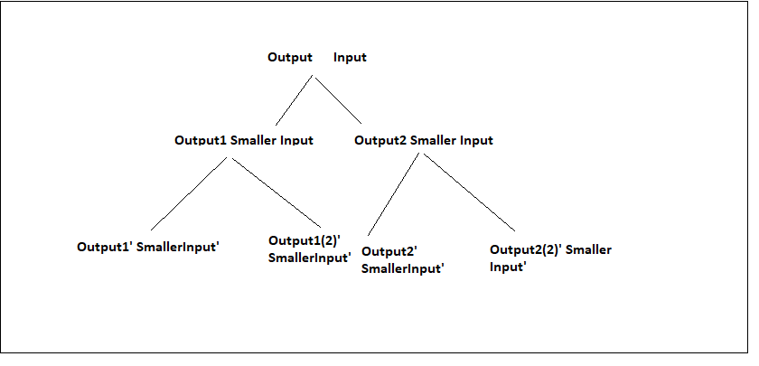
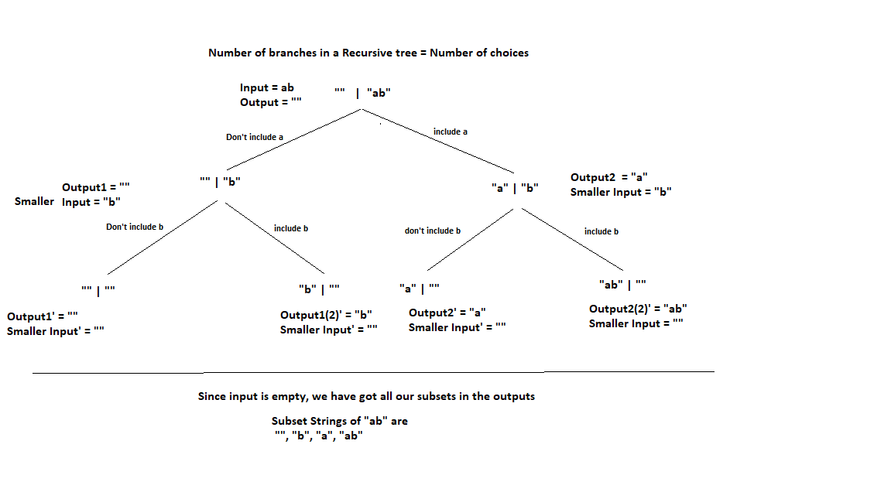

--------------------------
What is Recursion??
--------------------------

-> The process in which a function calls itself directly or indirectly is called recursion and the corresponding function is called a recursive function.

--------------------------
Recursion makes the input smaller. What does that mean?
Does it mean that we do something and input gets smaller?
--------------------------

When we use Recursion, we are not deliberately trying to make the input smaller. Instead, we do "something" that results in the input getting smaller. 

That "something" are some decisions that we take in recursion.
And based on these decisions, the input will be changed into smaller inputs automatically.

So, primary goal in Recursion is Decision Making, not making input smaller

--------------------------
IDENTIFICATION OF RECURSION
--------------------------

How can we idenitify whether a given problem is a recursive problem or not?

-> We use Recursion when we have a decision space and we want to choose a decision.

-> The problem will have some choices given to us and based on those choices we can take decisions.

--------------------------
RECURSIVE TREE <- very important in recursion
--------------------------

If we can design the recursive tree for a given problem, then writing the code for that problem becomes extremely easy.

--------------------------
EXAMPLE - RECURSIVE TREE
--------------------------

1. Subset Problem -> Given a string, represent all the subsets of it. 
e.g. String = "abc"
Its subset strings will be ["", a, b, c, ab, bc, ac, abc]

How can be know whether this problem is a recursive problem or not?

What are the choices ?

1. We can include a character in output substring
2. We don't include it in output substring

So, based on these choices, whatever decision we take, we get a subset.

e.g. if we include a, not incldue b and not include c, we get "a"
if we include a, include b, and not include c, we get "ab"
if we include a, include b,and include c, we get "abc"
if we do not include any one, we get ""

And so on...

And as we take decisions, out input will automatically get smaller.

--------------------------
WHAT IS A RECURSIVE TREE?
--------------------------

Let's take a string "ab". Subsets -> ["", a, b, ab]

What are the choices for a character?

1. We can include a character in output substring
2. We don't include it in output substring

e.g. if we include a, not incldue b, we get "a"
if we include a, include b we get "ab"
if we do not include a, include b we get "b"
if we do not include any one, we get ""

So, we want to represent these decisions nicely and that way of representation is called a RECURSIVE TREE. 

--------------------------
CREATING A RECURSIVE TREE
--------------------------

We can use a method where we start with some Output and some Input. e.g. we can take Output initially as "" and input as the given input

And in each step, we will take a decision and set out output and input accordingly. This way we will get a tree like structure called a Recursive Tree.

The number of branches = Number of choices.

--------------------------
EXAMPLE
--------------------------

String = "ab"

--------------------------
STEPS TO SOLVE ANY RECURSIVE PROBLEM
--------------------------

1. Design the Recursive Tree
2. Write the code (Will be extremely easy after we make Recursive Tree)