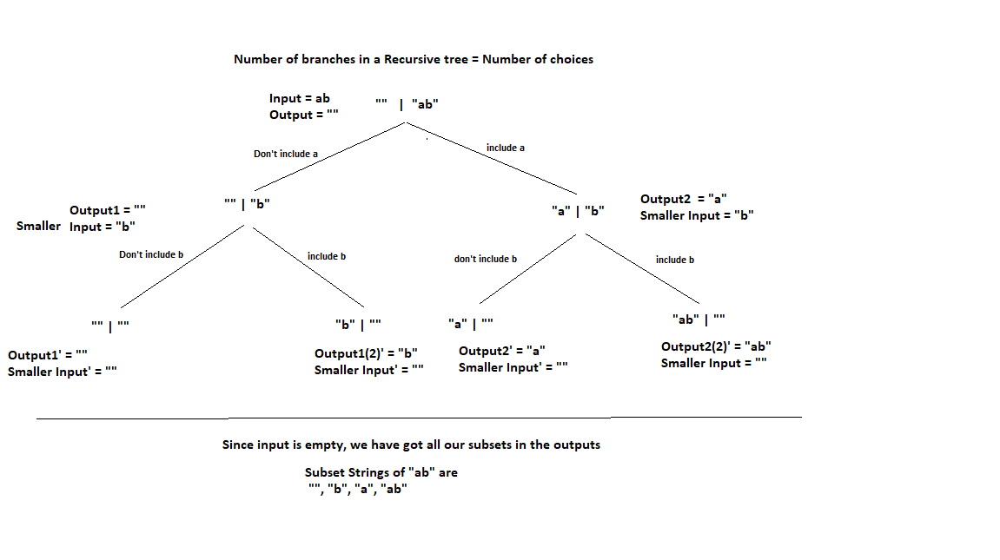

# PROBLEM STATEMENT

Given a string as input, generate all the subsets of the string.

# RECURSIVE TREE APPROACH

We can use the Input-Output method to generate the recursive tree for this problem (Discussed in Section 000).

So initially, we will take input = string and the output = "" and then we will decide if to include the character in substring or not to include it. This way, we will get a tree like structure and finally, when our input reduces to "", we will get all the substrings.

So, in this approach, we are not focusing on making the input smaller as we did in the Induction-base-Hypothesis method in previous problems. Here, we focus on decisions. Whatever decision we take, its result is that input will get smaller automatically.

If we decide to include a character in the output, then that character is removed from the input and put into output. But, if we decide not to include a character in output, that character is removed from input but output remains unchanged. If we do not include any character, we get an empty string "", something that is also a substring of a string.

# WRITING THE CODE

Our base condition will be whenever input is empty. If input becomes empty, that means we have got a substring so we can print the output.

    if(input.length === 0){
        console.log(output);
        return;
    }

And now, we just follow whatever our recursive tree shows us. So initially, we have input = string, output = ""

lets say input = "abc", output = ""

And now, we make two outputs -> One is same as before because we don't include the first character of string in it.

But the second output has the first character of string in it.

    output1 = output;
    output2 = "a";

And as we defined above, no matter if we include a character or not, that will be removed from the input string in each level of the recursive tree.

    input = "bc" <- we removed the firs character

And now, we got two new outputs and we need to call the method recursively for each of these outputs.

So again, we call ->

    substrings("bc", ""); 
    substrings("bc", "a");

which means -> 

    substrings(input, output1);
    substrings(input, output2);