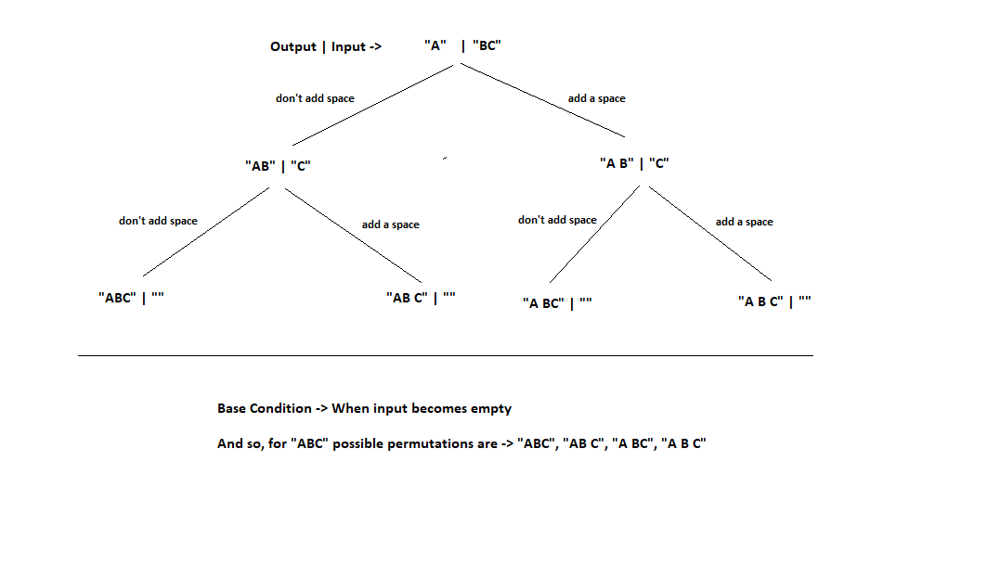

# PROBLEM STATEMENT

Given a String as an input. We need to print all possible strings that can be made by placing spaces (zero or one) in between them.

e.g. String = "ABC"

We can place 0 or 1 space between any two characters. So possible permutations for "ABC" are - 

ABC <- 0 space between A & B and also B & C

AB C <- 0 space between A & B and 1 space between B & C

A BC <- 1 space between A & B and 0 space between B & C

A B C <- 1 space between A & B and 1 space between B & C

# RECURSIVE APPROACH

What are our choices? 

-> We add a space 
-> We do not add a space

Also, we are told to add spaces between the characters which basically means no matter what the input is, the first character of input will always be the first character of output since we cannot add a space before first character. Hence, we initialize our output with the first character and remove the first character from input.

And based on all of this, we can create our recursive tree.

## BASE CONDITION

In above recursive tree, we can see, the leaf node has all the permutations and input string becomes empty. So, base condition is when input becomes empty. That's when we got one permutation so we can put that in a list.