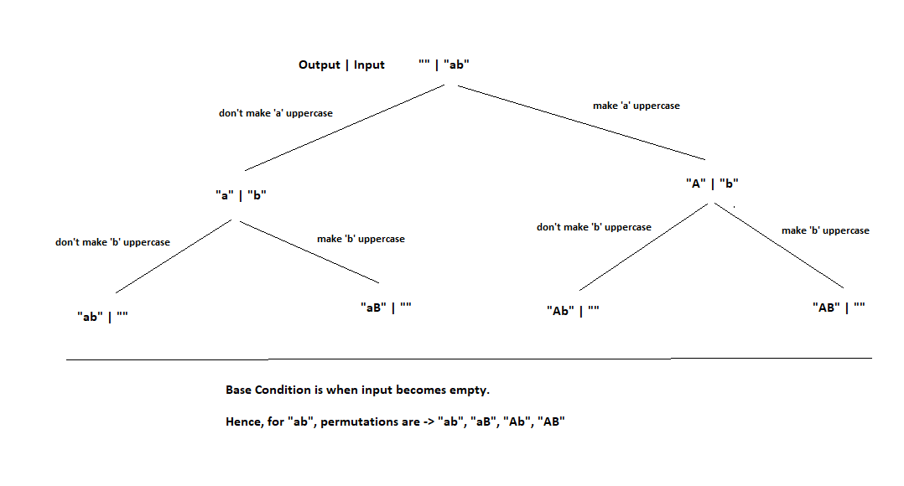

# PROBLEM STATEMENT

We are given a lowercase string e.g. "ab". Print all permutations of a string keeping the sequence but changing cases.

e.g. for "ab" -> "ab", "aB", "Ab", "AB"

# RECURSIVE SOLUTION

Here as well, we have two choices ->

    1. Either make a character uppercase
    2. Not make a character uppercase

So, the recursive tree will be quite easy.

## BASE CONDITION

Base Condition will be when input becomes empty. At that time, we just put the output in the list and return from there.