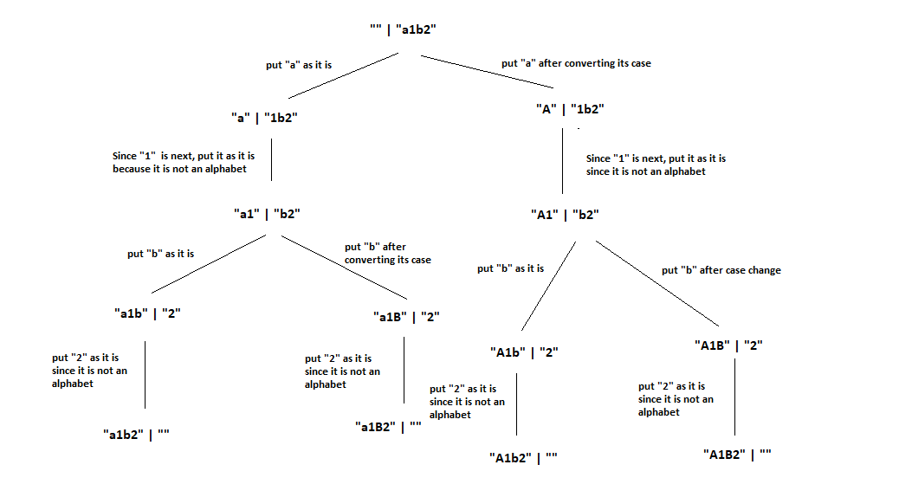

# PROBLEM STATEMENT

Given a string s, you can transform every letter individually to be lowercase or uppercase to create another string.

s consists of lowercase English letters, uppercase English letters, and digits.

e.g. s = "a1b2"

So its permutations will be -> ["a1b2","a1B2","A1b2","A1B2"]

# RECURSIVE APPROACH

For each character -> what are the choices?

If it is uppercase already then we have two choices ->
    1. Either make it lowercase and then put in output
    2. Leave it as it is and put in output.

The same choices are there if a character is lowercase already ->
    1. Either make it uppercase and then put in output
    2. Leave it as it is and put in output.

Hence, for each alphabet we have two choices only ->
    1. If uppercase, make it lowercase and put in output. Or if lowercase then make it uppercase then put in output.
    2. Put it as it is in the output without any case change.

What about the non-alphabets??? This problem says that there can be digits too. So, we have to filter out those. 

## RECURSIVE TREE

If we see the recursive tree, then we will see that when there is an alphabet, we always have two choices i.e., two outputs i.e, two recursive calls.
But if we have a digit, then we only have one choice i.e., put the digit in the output. That's it. So, we have only one recursive call in that case.

Hence, in case of an alphabets, we will make two outputs. Put the character as it is in one and put its case converted value in the other.
Then make two recursive calls for each output.

In case of a digit, we have only one output in which we simply put the digit. And then make one recursive call on that single output.