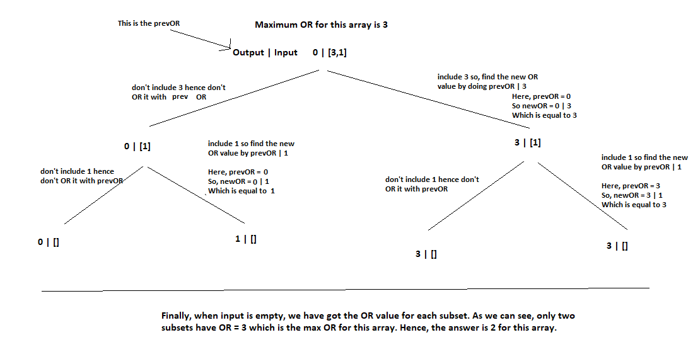

# PROBLEM STATEMENT

Given an integer array nums, find the maximum possible bitwise OR of a subset of nums and return the number of different non-empty subsets with the maximum bitwise OR.

e.g. [3,1]

The Max bitwise OR of this array is 3 

Non-Empty Subsets of [3,1]  -> [1], [3], [1,3]

Only two subsets have OR = Max Bitwise OR hence, Return 2

# RECURSIVE APPROACH

If we make a recursive tree of this problem, then we will see that we have two choices basically -> Either to take a number into a substring or not to take it. Just like how we were doing in previous subset problems.

But here, the catch is we have to find the OR of each subset. So, instead of first finding all subsets, then finding OR for each subset, what we can do is, in each decision, if we take a number, OR it with the previous OR.

So basically, output will be 0 initially and input will be the given array. 

And in each choice, if we decide to take an element from input, then we take that element and OR it with the previous OR. If we do not take that element, OR remains unchanged. 

This way, when our base condition is reached, we can simply check if the OR so far for this subset is equal to maxOR or not. If it is, we update the count otherwise we do not.

## RECURSIVE TREE

