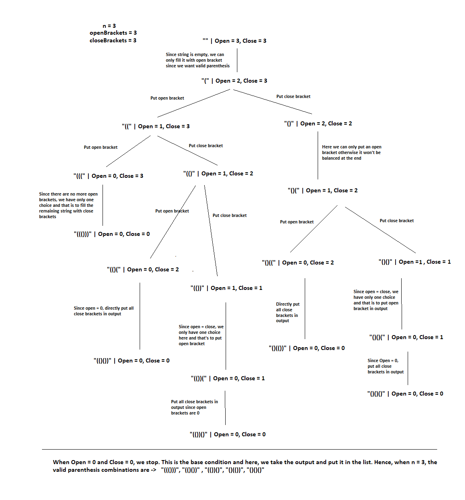

# PROBLEM STATEMENT

Given a number, N. We have to generate all the balanced parenthesis. Parenthesis used will be -> normal parenthesis only i.e., ()

e.g. n = 2 means we can use two open brackets and two closed brackets.

so, if we have () and (), then we can have following outputs ->
 ["(())","()()"]

suppose n = 3, in that case, we have three open brackets and three close brackets. So valid combinations are ->

 ["((()))","(()())","(())()","()(())","()()()"]

# IDENTIFY RECURSION IN THIS PROBLEM

If we want to identify whether this problem can be solved using Recursion, we need to look at what the choices are and what are the decisions. If we can find any, that means, we can use Recursion to solve it.

lets take n = 3

That means we have 6 empty placed to fill in the output. 

        _ _ _ _ _ _

For each empty space, we have two choices ->
    1. Fill it with open bracket -> (
    2. Fill it with close bracket -> )

And we have to take decision such that the generated string is balanced. We cannot say -> )()()( This is not balanced.

# RECURSIVE TREE

So, as we can see with this recursive tree, there are some special cases to handle. 

If open brackets are same as close brackets, that means, we can only put open bracket. SO tehre is only one choice.
Also, if Open brackets are 0, then we have only one choice and that is to put all the close brackets in the output.

The base condition is when Open brackets = 0 and close brackets = 0.