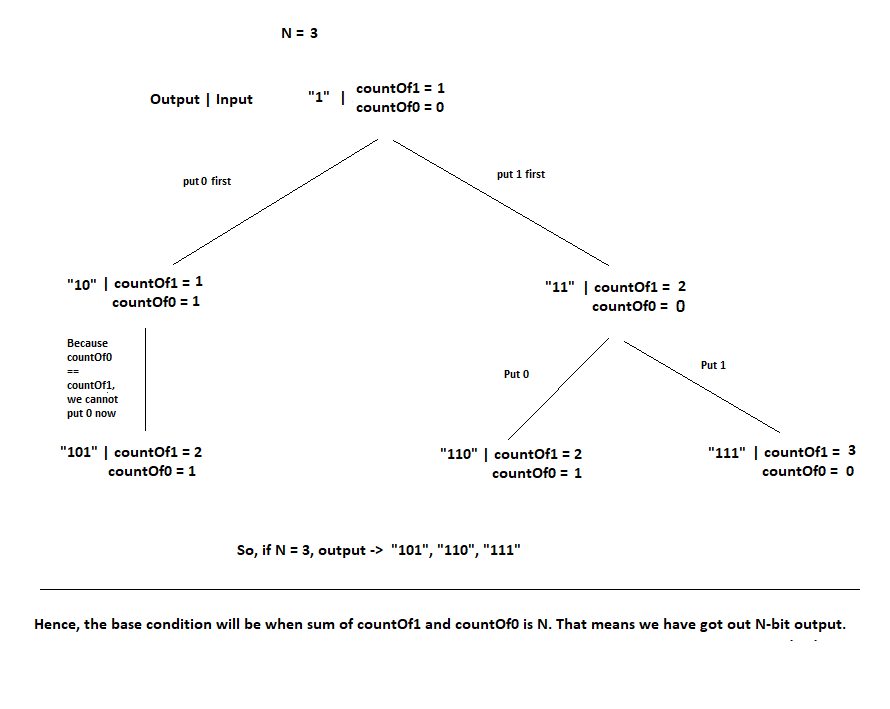

# PROBLEM STATEMENT

Given a positive integer N, the task is to find all the N bit binary numbers having more than or equal 1’s than 0’s for any prefix of the number.

e.g. N = 2

That means, output all the N bit binary numbers with 1s more than of equal to 0s.

In this case, we will get -> "11" and "10"

"00" will be invalid here because it has no 1 and we want 1s to be there in the number and they should be equal or more than 0s.

# RECURSIVE APPROACH

Here, N = 2 means we have basically two spaces to fill. And each space can either have 1 or 0. So this is our choice. 

We also need to make sure we keep the count of 1 and 0s so that count of 0s does not exceed count of 1.

So to ensure that, initially what we do is initialize our output string with "1". This also means, countOf1 initially = 1, countOf0 = 0.

So that from the beginning itself, count of 1 > 0

And now, we can design a recursive tree. 

## RECURSIVE TREE

## BASE CONDITION

When the countOf1 + countOf0 == N that means we got one output. So we push the output to the list and return from there.

Also, when the countOf1 and countOf0 is same, that means we cannot put 0 next as it will violate the rule which says countOf1 should be equal or more than countOf0. So in that case we only need to put 1 and increment our countOf1. So there is only one choice in that case.